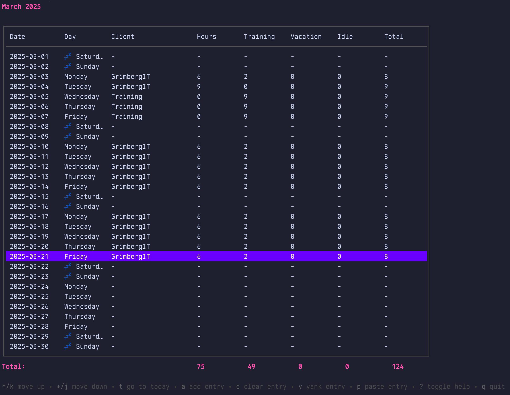

# Timesheetz - write hours like a unicorn


## Description

Timesheetz is a timesheet management application with two interfaces:

- **Terminal User Interface (TUI)**: Add, view, and delete timesheet entries
  directly from your terminal.
- **REST API**: Programmatically manage timesheet entries through HTTP
  endpoints. Supports the same operations as the TUI.

The application stores all entries in a Sqlite database and features:

- 📅 Monthly calendar view with weekend indicators
- 📋 Copy/paste functionality with visual feedback
- 📊 Automatic total calculations
- 📤 Export to PDF or Excel
- 📧 Email integration via Resend.com
- 🔄 Real-time updates via API
- ⌨️ Vim-inspired keyboard shortcuts
- 🔄 Automatic startup on system boot
- 🛠️ Easy management with control scripts



## Installation

### Quick Install

1. Download the latest release from the [releases page](https://github.com/joelgrimberg/timesheetz/releases)
2. Extract the archive
3. Run the installation script:
   ```bash
   cd timesheetz
   chmod +x scripts/install.sh
   ./scripts/install.sh
   ```

### Manual Installation

1. Download the appropriate binary for your system from the [releases page](https://github.com/joelgrimberg/timesheetz/releases)
2. Make the binary executable:
   ```bash
   chmod +x timesheet-<os>-<arch>
   ```
3. Move the binary to a directory in your PATH:
   ```bash
   mv timesheet-<os>-<arch> ~/.local/bin/timesheet
   ```

### Building from Source

1. Clone the repository:
   ```bash
   git clone https://github.com/joelgrimberg/timesheetz.git
   cd timesheetz
   ```

2. Build the project:
   ```bash
   ./scripts/build.sh
   ```

3. Install the Launch Agent (macOS):
   ```bash
   ./scripts/install.sh
   ```

### Auto-start on macOS (Background Launch at Login)

The installation script will:
- Create a Launch Agent in `~/Library/LaunchAgents`
- Configure Timesheetz to start at login and run in the background
- Write logs to `~/Library/Logs/timesheetz.out` and `~/Library/Logs/timesheetz.err`

**To verify or manage the Launch Agent:**
- Check if it's running:
  ```bash
  launchctl list | grep timesheetz
  ```
- Stop auto-starting:
  ```bash
  launchctl unload ~/Library/LaunchAgents/com.timesheetz.plist
  ```
- Remove the Launch Agent:
  ```bash
  rm ~/Library/LaunchAgents/com.timesheetz.plist
  ```

### Running Multiple Instances

When the Launch Agent is running (on port 8080), you can start additional instances of Timesheetz from the CLI:

1. For a terminal UI instance, use a different port:
   ```bash
   ./bin/timesheet --port 8081
   ```

2. For a background instance, use the `--no-tui` flag:
   ```bash
   ./bin/timesheet --no-tui --port 8082
   ```

All instances will share the same database, allowing you to:
- Have the app running in the background via Launch Agent
- Use the terminal UI for quick entries or queries
- Run multiple background instances if needed

**Note:** If you get a port binding error, it means the port is already in use. Try using a different port number.

## Usage

After installation, you can run Timesheet using the following command:

```bash
timesheet
```

For more options, run:
```bash
timesheet --help
```

## Managing the Application

The application comes with a management script that provides easy control over the application lifecycle:

```bash
# Check application status
./scripts/manage.sh status

# Stop the application
./scripts/manage.sh stop

# Start the application
./scripts/manage.sh start

# Restart the application
./scripts/manage.sh restart

# Reload the application (graceful reload)
./scripts/manage.sh reload
```

### Updating the Application

To update to a newer version:

1. Stop the current version:
   ```bash
   ./scripts/manage.sh stop
   ```

2. Build and install the new version:
   ```bash
   ./scripts/build.sh
   ./scripts/install-mac.ps1 or install-win.ps1 or install-linux.sh
   ```

3. Start the new version:
   ```bash
   ./scripts/manage.sh start
   ```

Or simply use the restart command:
```bash
./scripts/manage.sh restart
```

## Usage

Run the application in dev mode as a TUI with the following command:

```bash
make dev
```

Run the application as a background service with the --no-tui flag:

```bash
make dev ARGS="--no-tui"
```

### Command-line Flags

The application supports the following command-line flags:

- `--no-tui`: Run only the API server without the TUI
- `--port <number>`: Specify the port for the API server (default: 8080)
- `--dev`: Run in development mode (uses local database)
- `--init`: Initialize the database
- `--help`: Show help message
- `--verbose`: Show detailed output

Example:
```bash
# Run API server on port 3000 in development mode
./timesheet --no-tui --port 3000 --dev

# Show help message
./timesheet --help
```

The application uses keyboard shortcuts for navigation and actions. See the
[keyboard shortcuts guide](docs/shortcuts.md) for a comprehensive list of
available commands.

## Configuration

The application can be configured through `config.json`:

- Set document type (PDF/Excel) for exports
- Configure email settings (requires Resend.com API key)
- Enable/disable API server
- Set development mode to avoid cluttering production data

## Development

Within the config file, make sure to set mode to "development" to not clutter
your production data.

## Logging

Log files can be found in the following locations:
- macOS: `$HOME/Applications/Timesheetz/error.log` and `output.log`
- Windows: `%LOCALAPPDATA%\Timesheetz\`
- Linux: Use `journalctl --user -u timesheetz.service`

## API Documentation

The application provides a REST API for programmatic access. See the
[API documentation](docs/api.md) for available endpoints and examples.

## TODO

- [ ] update Readme and setup github pages
- [ ] Build application in pipeline
- [ ] Add RayCast extension
